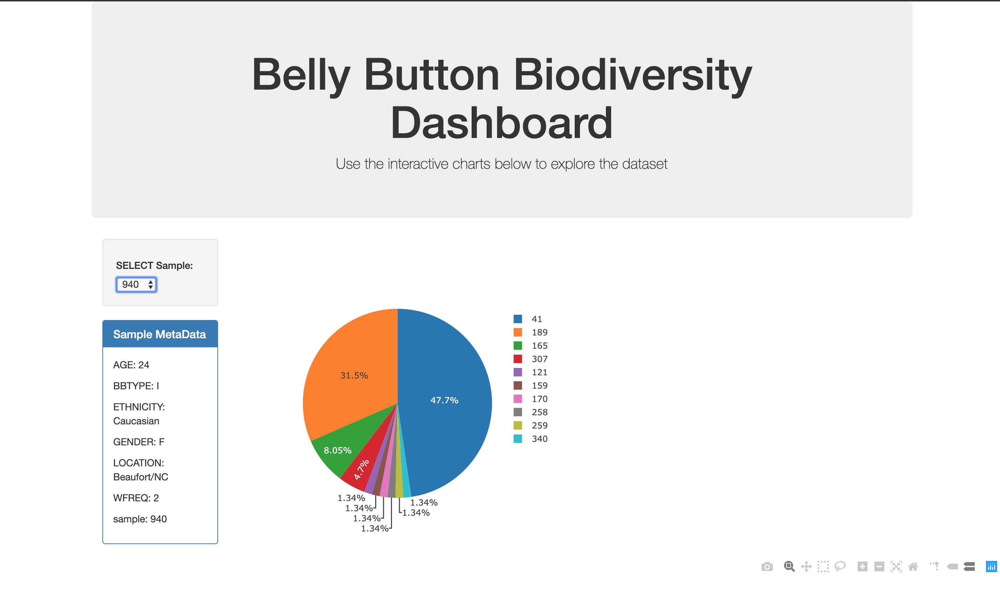

# plotly-bellybuttonapp

App hosted on heroku: https://mkung-bellybuttondiversity.herokuapp.com/

This app uses Plot.ly to present data of belly button diverity.
App is a dashboard showing metadata, pie chart, and bubble chart.

Technologies used:
 -JavaScript
 -Plot.ly
 -SQLite
 -HTML

Screenshot:

